## Welcome to Donna Cat Cofee

### Mô tả về dự án

Đây là dự án nằm trong khuôn khổ môn Software development project (SWP391). Đây là 1 trang web system dành cho chuỗi cách cửa hàng của Donna Cat Coffee với 5 role chính là: Guest, Customer, Staff,Manager và Admin

Dự án được thực hiện bằng ngôn ngữ C# và dùng framework Reactjs, được thực hiện trong 1 kì.

### Screen-shots

Guest
Xem được giới thiệu, chi nhánh, menu, mèo

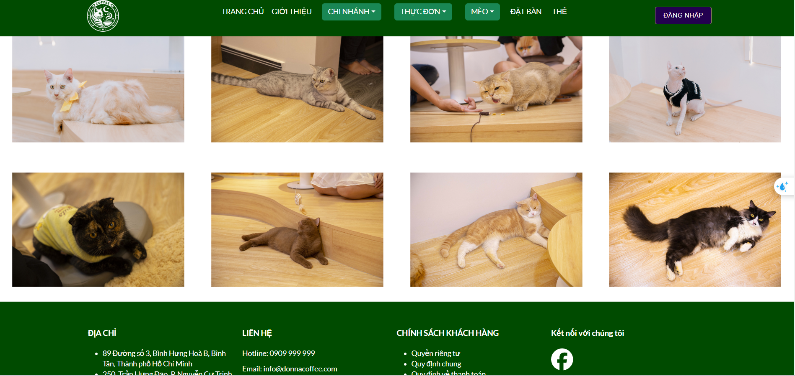
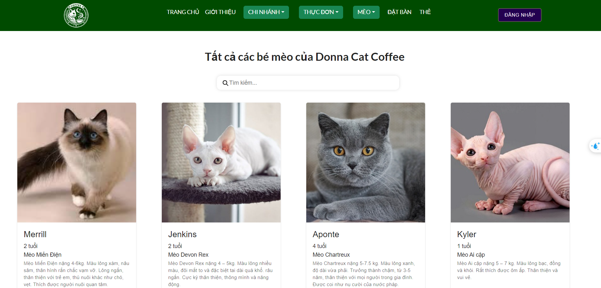
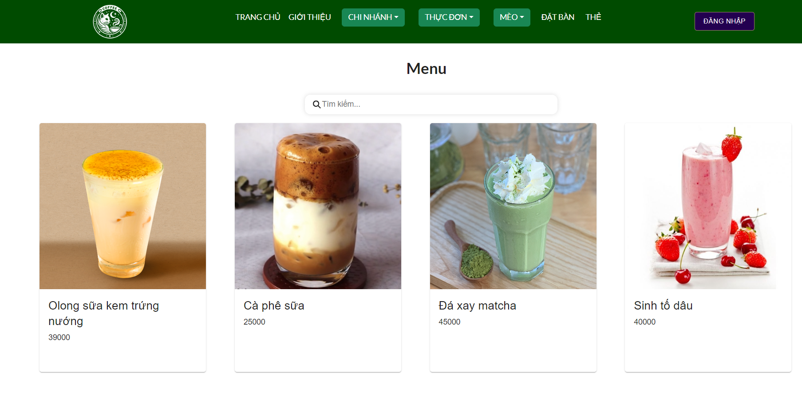
Customer
Thực hiện các chức năng của Guest nhưng được đặt bàn
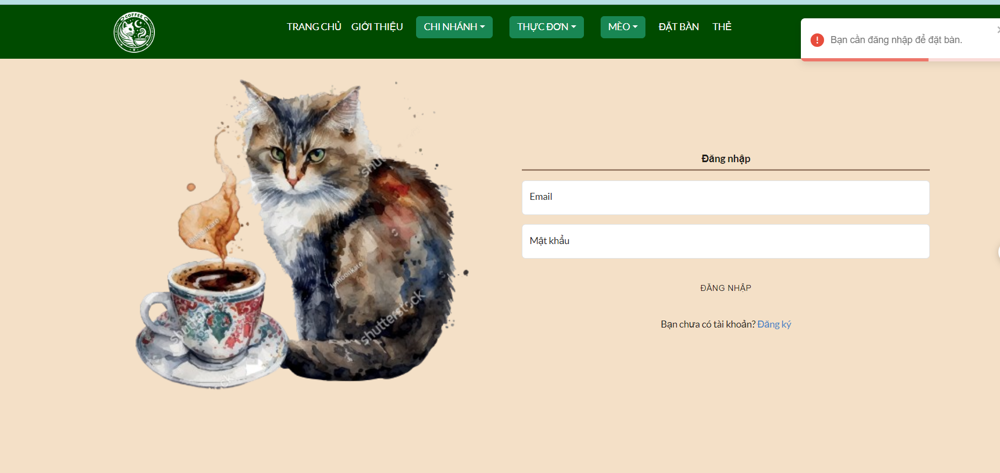
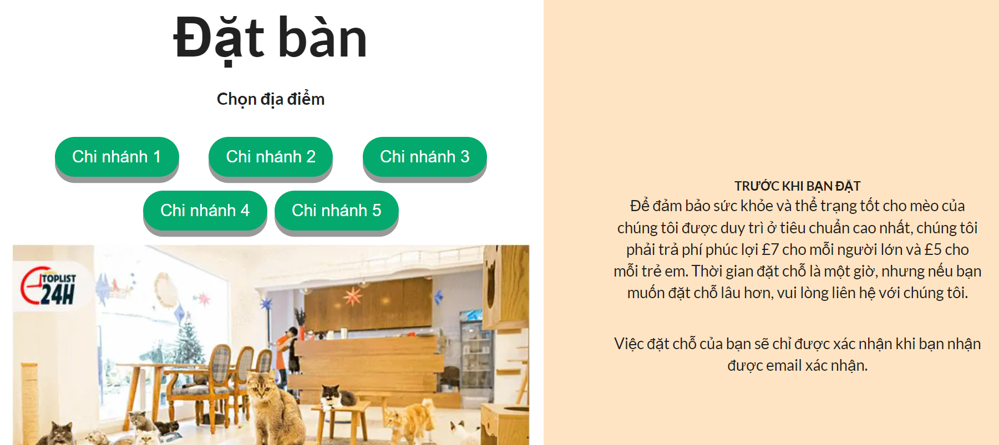
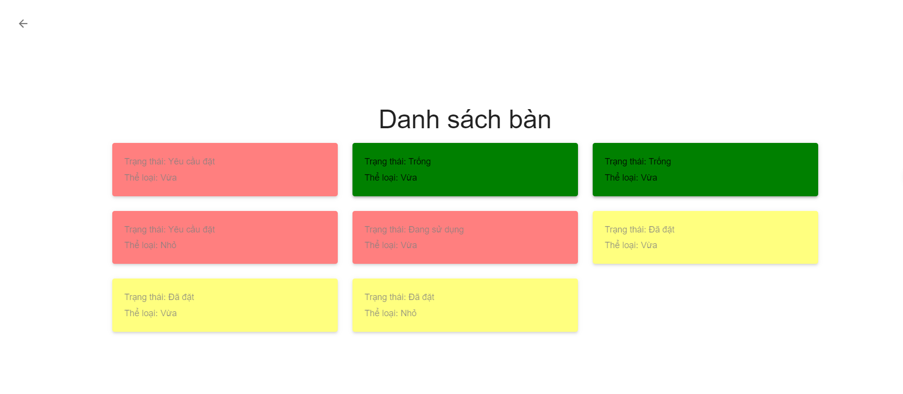
Staff
Sẽ set trạng thái bàn và tạo order nước cho khách và payment
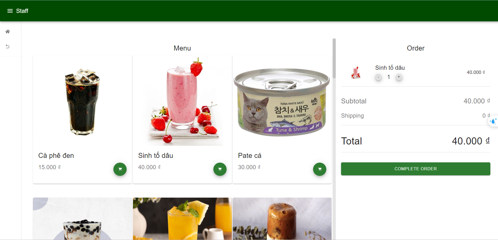
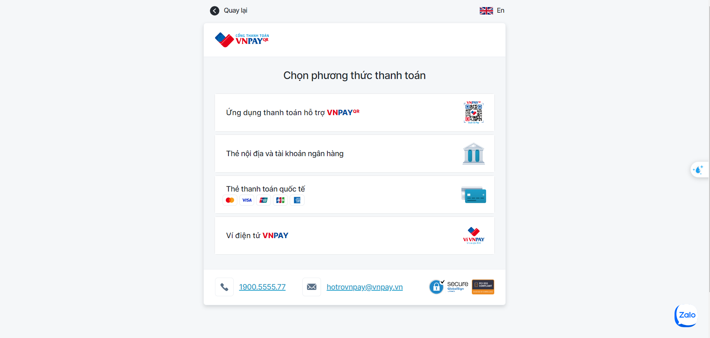
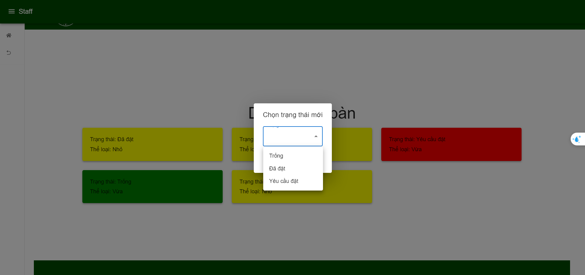
Manager
Sẽ CRUD mèo, sản phẩm cho mèo, menu và staff
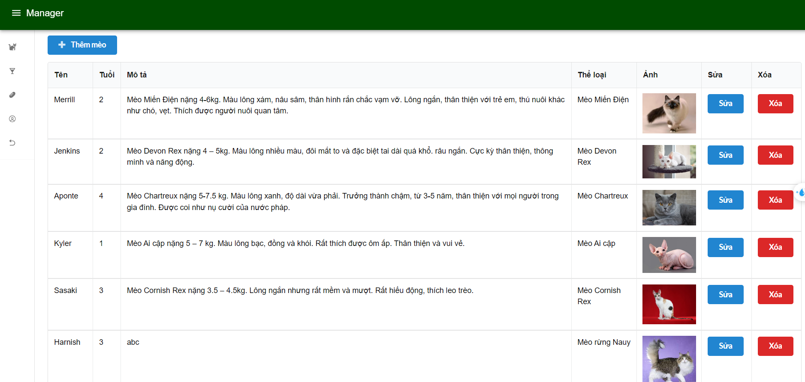
Admin
Xem được tổng doanh thu, tổng sản phẩm và CRUD chi nhánh
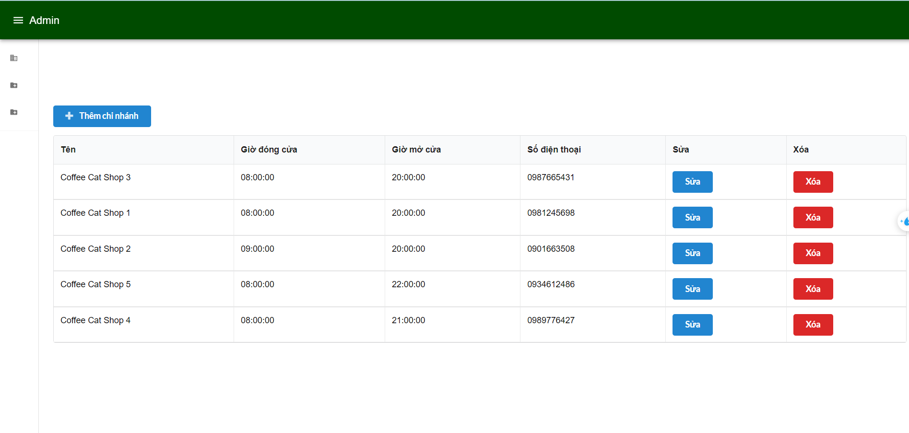
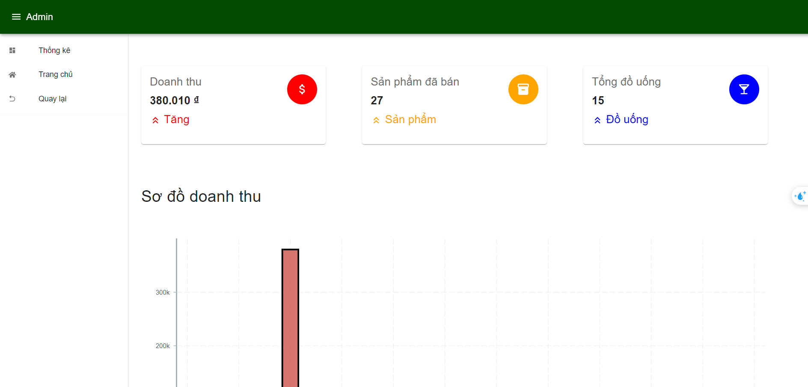

#### Connect me via: yenvy.sunny@gmail.com

#### &#169; 2024 Yen Vy
