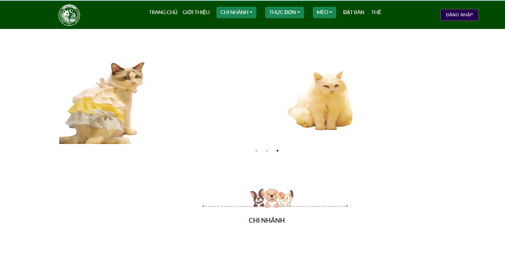

## Welcome to Donna Cat Cofee

### Mô tả về dự án

Đây là dự án nằm trong khuôn khổ môn Software development project (SWP391). Đây là 1 trang web system dành cho chuỗi cách cửa hàng của Donna Cat Coffee với 5 role chính là: Guest, Customer, Staff,Manager và Admin

Dự án được thực hiện bằng ngôn ngữ C# và dùng framework Reactjs, được thực hiện trong 1 kì.

### Screen-shots

Guest

#### Connect me via: yenvy.sunny@gmail.com

#### &#169; 2024 Yen Vy
